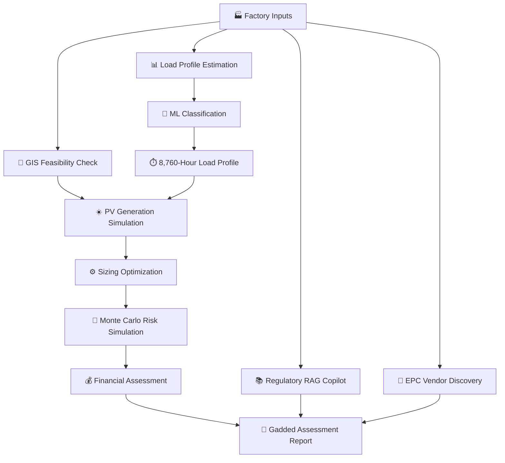

# ☀️ Gadded — AI-Powered Solar Decision Support

<p align="center">
  <strong>Smarter Decisions. Greener Industry.</strong>
</p>

<p align="center">
  AI-driven solar pre-development decision support for Egyptian factories.
</p>

<p align="center">
  Built for <strong>AI Empower Egypt 2026 — Renewable Energy Using AI</strong>
  <br>
  Powered by <strong>Dell Technologies</strong>
</p>

---

## 🌍 Overview

**Gadded** is an AI-powered solar decision-support platform designed to help
Egyptian factories evaluate the technical, financial, regulatory, and
operational feasibility of rooftop solar energy.

Factory owners often face complex decisions before investing in solar energy:

- How much solar capacity does the factory actually need?
- How much electricity can the system generate?
- How much of that energy can be consumed on-site?
- What would the investment cost and expected financial return be?
- What regulatory requirements and approvals are involved?
- Which solar EPC companies have relevant industrial experience?

Gadded brings these considerations together in a single, transparent,
and evidence-based assessment workflow.

Instead of relying on simplified assumptions or sales-driven recommendations,
Gadded combines **machine learning, physics-based solar simulation,
financial optimization, uncertainty analysis, geospatial checks,
and AI-powered information retrieval** to support more informed
early-stage investment decisions.

> **Gadded transforms the early solar feasibility process from a
> complex, fragmented task into a structured assessment that can
> be completed within minutes.**

---

## 🎯 The Problem

Egyptian factories and small-to-medium enterprises face several barriers
to rooftop solar adoption.

### ⚡ 1. Limited Electricity Consumption Data

Many facilities do not have smart-meter interval data.

As a result, solar system sizing often relies on monthly electricity bills,
which do not capture hourly demand patterns.

This can lead to:

- Oversized systems and inefficient capital allocation.
- Undersized systems that fail to meet expected energy needs.
- Limited visibility into solar self-consumption.

### 💰 2. Financial Uncertainty

Solar investment decisions require more than a basic payback calculation.

Factory owners need to consider:

- Electricity tariff changes.
- System degradation.
- Financing structures.
- Long-term savings.
- Investment risk and uncertainty.

### 📋 3. Regulatory Complexity

Understanding solar connection models, permitting requirements,
grid constraints, and applicable regulations can be difficult.

### 🏗️ 4. Vendor Discovery

Finding reliable EPC providers with relevant commercial and industrial
solar experience requires research and verification.

---

## 💡 Our Solution

Gadded provides an integrated workflow that helps answer three critical
questions:

| Question | Gadded's Approach |
|----------|-------------------|
| Is the project technically and spatially feasible? | GIS checks and solar generation modeling |
| What system size provides economic value? | Load matching, financial optimization, and risk simulation |
| What should happen next? | Cited regulatory roadmap and evidence-backed EPC leads |

Gadded is designed to support **early-stage decision-making**.
It does not replace detailed engineering studies, official approvals,
or professional financial and regulatory advice.

---

## 🚀 Key Features

### 📊 1. Industrial Load Profile Estimation

Gadded estimates hourly electricity demand when measured interval data
is unavailable.

The pipeline combines:

- K-Means clustering for operational pattern discovery.
- Random Forest classification for load archetype prediction.
- Deterministic fallback rules for low-confidence predictions.
- Monthly consumption-based profile scaling.

The system generates a representative **8,760-hour annual load profile**
for solar-to-load matching.

> The proof of concept uses synthetic load profiles.
> Model performance should not be interpreted as validation on measured
> Egyptian factory electricity data.

---

### ☀️ 2. Physics-Based Solar Generation Simulation

Gadded uses **pvlib** to model photovoltaic system performance.

The simulation considers relevant parameters such as:

- Solar irradiance.
- Ambient temperature.
- Panel orientation.
- Temperature coefficients.
- Inverter efficiency.
- System losses.
- Degradation assumptions.

The result is an hourly solar generation profile for candidate PV system sizes.

---

### 📍 3. Geospatial Feasibility Assessment

The GIS module evaluates location-related constraints using spatial datasets.

It supports checks involving:

- Facility location.
- Industrial zones.
- Environmental restrictions.
- Protected-area boundaries.
- Site suitability considerations.

These checks help identify potential constraints before detailed engineering.

---

### 💰 4. Financial Optimization

Gadded evaluates candidate solar capacities to identify configurations
that maximize projected financial value.

The optimization considers:

- Available roof area.
- Grid connection capacity constraints.
- User-defined budget.
- Electricity bill savings.
- Net-metering export assumptions.
- Long-term project economics.

The system evaluates financial outcomes over a **25-year operational lifecycle**.

---

### 🎲 5. Monte Carlo Risk Simulation

Financial projections are uncertain.

Rather than presenting only one static payback estimate, Gadded uses
a Monte Carlo simulation with **1,000 iterations**.

The simulation explores uncertainty in variables such as:

- Solar irradiance.
- Electricity tariff adjustments.
- Inflation.
- Other defined financial assumptions.

This produces a distribution of potential financial outcomes and
payback periods.

---

### 📚 6. Regulatory Copilot (RAG)

Gadded integrates Retrieval-Augmented Generation (RAG) to support
regulatory information retrieval.

The regulatory copilot:

1. Retrieves relevant regulatory documents.
2. Identifies applicable requirements.
3. Synthesizes a structured permitting roadmap.
4. Provides citations to retrieved source material.

The goal is to make complex regulatory information more accessible
while keeping recommendations grounded in source evidence.

> Regulatory information must be verified with the relevant Egyptian
> authorities before implementation.

---

### 🏢 7. Evidence-Grounded EPC Vendor Discovery

Gadded includes an AI-powered vendor discovery workflow.

The system searches for solar EPC providers operating in Egypt
and extracts relevant information, including:

- Company details.
- Industrial and commercial solar experience.
- Project evidence.
- Contact channels.
- Source references.

The purpose is to help factory owners identify potential vendors
for further evaluation.

Vendor inclusion does not constitute certification, endorsement,
or a guarantee of service quality.

---

## 🧠 Technical Architecture

Gadded follows a hybrid architecture combining deterministic
engineering calculations, machine learning, optimization,
and AI-powered information retrieval.



### Core Technologies

| Component | Technology |
|-----------|------------|
| Programming Language | Python 3.12+ |
| Data Processing | Pandas, NumPy |
| Machine Learning | Scikit-learn |
| Solar Simulation | pvlib |
| AI Reasoning | Gemini |
| Vendor & Financing Search | Groq-powered workflow |
| Regulatory Retrieval | RAG + Vector Database |
| Geospatial Analysis | GeoPandas / Spatial Data |
| User Interface | Streamlit |
| Testing | Pytest |
| Showcase | Jupyter Notebook |

---

## 🔄 End-to-End Workflow

```text
1. Factory Information
   │
   ├── Location
   ├── Industrial Sector
   ├── Monthly Electricity Consumption
   ├── Roof Area
   └── Operating Schedule
   │
   ▼
2. Spatial Feasibility
   │
   ▼
3. Industrial Load Estimation
   │
   ▼
4. Hourly Solar Generation Simulation
   │
   ▼
5. PV Sizing & Load Matching
   │
   ▼
6. Financial Optimization
   │
   ▼
7. Monte Carlo Risk Simulation
   │
   ▼
8. Regulatory Roadmap
   │
   ▼
9. EPC Vendor Discovery
   │
   ▼
📄 Preliminary Solar Feasibility Assessment
```

---

## 📈 Prototype Results

The proof of concept was evaluated using synthetic industrial
consumption datasets, physics-based solar simulations, and regulatory
document test suites.

| Metric | Result |
|--------|--------|
| Model Version | load-cluster-classifier-0.1.0 |
| Number of Clusters (K) | 6 |
| Training Facilities | 67 |
| Testing Facilities | 23 |
| Classifier Test Accuracy | 95.65% |
| Baseline Test Accuracy | 91.30% |
| Silhouette Score (Train) | 0.428 |
| Adjusted Rand Index | 0.653 |
| Monte Carlo Iterations | 1,000 |
| Annual Assessment Runtime | Under 3 seconds* |

\* Runtime reported in the project documentation for the tested
prototype environment.

### ⚠️ Model Limitations

The load classification model was trained entirely on a synthetic
parametric population rather than measured Egyptian factory
interval data.

Therefore, the reported classification accuracy validates the
tested methodology but does not establish generalization to
real-world Egyptian industrial load patterns.

---

## 📁 Project Structure

```text
gadded/
│
├── src/
│   └── gadded/
│       ├── contracts/
│       ├── weather/
│       ├── pv/
│       ├── load/
│       ├── load_ml/
│       ├── matching/
│       ├── optimization/
│       ├── finance/
│       ├── risk/
│       ├── gis/
│       ├── regulatory/
│       ├── vendors/
│       ├── feasibility/
│       └── report/
│
├── data/
│   ├── golden_case.json
│   ├── assumptions.json
│   ├── cached_weather/
│   ├── load_archetypes/
│   ├── regulatory_excerpts/
│   └── zones.geojson
│
├── tests/
│   └── pytest suite
│
├── gadded.ipynb
├── app.py
├── requirements.txt
├── requirements.lock.txt
├── .env.example
└── docs/
    └── gadded.pdf
```

---

## ⚙️ Setup

### Prerequisites

- Python 3.12+
- pip
- Jupyter Notebook
- API keys for the AI-powered stages

Developed and tested on Python 3.14.

### 1. Clone the Repository

```powershell
git clone <YOUR_REPOSITORY_URL>
cd gadded
```

### 2. Create a Virtual Environment

```powershell
python -m venv .venv
```

Activate the environment:

```powershell
.\.venv\Scripts\Activate.ps1
```

For macOS/Linux:

```bash
source .venv/bin/activate
```

### 3. Install Dependencies

```powershell
pip install -r requirements.txt
```

For pinned dependencies:

```powershell
pip install -r requirements.lock.txt
```

### 4. Configure Environment Variables

Copy `.env.example` to `.env`:

```powershell
Copy-Item .env.example .env
```

Add your API keys:

```env
GEMINI_API_KEY=your_gemini_api_key
GROQ_API_KEY=your_groq_api_key
```

API keys are required only for the regulatory, vendor,
and financing stages.

**Do not commit your `.env` file or expose API keys publicly.**

---

## ▶️ Running Gadded

### 📓 Run the Showcase Notebook

The notebook is the main graded artifact and demonstrates
the complete assessment pipeline using the golden case.

```powershell
jupyter notebook gadded.ipynb
```

### 🖥️ Launch the Streamlit Demo

The Streamlit interface is an optional UI for the live demonstration.

```powershell
streamlit run app.py
```

### 🧪 Run Tests

```powershell
pytest
```

Tests cover formula validation, reconciliation,
and evidence-related checks.

---

## 🗂️ Data & Assumptions

Gadded maintains source classifications for external values
used throughout the assessment.

Each external value includes a source and classification
in `data/assumptions.json`.

### Source Classifications

| Classification | Description |
|----------------|-------------|
| OFFICIAL | Official source material |
| MARKET_RANGE | Market-based estimate or range |
| LITERATURE_PROXY | Value informed by published literature |
| SYNTHETIC | Artificially generated data |
| DEMO | Demonstration placeholder |

> Values labeled `DEMO` are placeholders and must be replaced
> with appropriately sourced figures before formal use.

---

## 🌐 Data Sources

The project integrates several data sources and datasets:

| Source | Purpose |
|--------|---------|
| NASA POWER | Hourly meteorological data |
| WDPA | Protected-area spatial data |
| NREA | Egyptian renewable energy information |
| EgyptERA | Regulatory information |
| Ministry of Electricity | Energy and regulatory context |
| IDA / EEAA | Industrial and environmental regulatory context |
| Kaggle Steel Industry Dataset | Load modeling development reference |

The specific sources and references are documented in the
project documentation and data configuration.

---

## 🔮 Future Roadmap

Gadded is designed to evolve beyond preliminary solar assessments.

### 🔋 1. Battery Energy Storage Systems (BESS)

Extend the platform to evaluate battery storage
and hybrid renewable energy configurations.

### 📡 2. Smart Meter Integration

Support direct processing of measured hourly electricity
consumption data to improve load profile calibration.

### 📊 3. Advanced Tariff Modeling

Introduce more detailed tariff structures, time-of-use pricing,
and updated connection fee assumptions.

### 🏗️ 4. Enhanced EPC Matching

Improve vendor matching using:

- Historical project data.
- Regional service coverage.
- Industrial specialization.
- Quote comparison capabilities.

### 📄 5. Automated Document Verification

Process uploaded engineering drawings, structural certificates,
and land ownership documents to identify missing information
and potential compliance requirements.

### 🌍 6. Broader Renewable Energy Expansion

Explore integration with energy management systems,
financing partners, and expansion across industrial sectors
and African markets.

---

## 🌱 Impact

Gadded aims to support multiple stakeholders in the renewable
energy ecosystem.

| Stakeholder | Potential Value |
|-------------|-----------------|
| 🏭 Factory Owners | Clearer feasibility insights and investment planning |
| 🏛️ Government Authorities | Support for distributed renewable energy adoption |
| 🏢 EPC Developers | Structured leads and standardized project information |
| 💳 Financial Institutions | Assessment reports for financing evaluation |
| 🌍 Environment | Support for industrial decarbonization |

By improving access to transparent feasibility information,
Gadded aims to reduce the barriers that prevent factories
from exploring renewable energy investments.

---

## 🏆 Hackathon

**AI Empower Egypt 2026 — Renewable Energy Using AI**

Gadded was developed as an AI-driven solution focused on
industrial renewable energy adoption.

The project combines:

- Artificial intelligence.
- Machine learning.
- Solar energy simulation.
- Financial analysis.
- Regulatory intelligence.
- Evidence-grounded vendor discovery.

---

## ⚠️ Disclaimer

Gadded provides a preliminary decision-support assessment.

Its results must be verified through qualified professionals
and the responsible authorities before any formal investment,
engineering, regulatory, or financing decision.

The platform does not replace:

- Detailed engineering studies.
- Structural assessments.
- Official regulatory approvals.
- Grid connection studies.
- Qualified financial advice.
- EPC due diligence.

---

## 👥 Team

**Hacktastic Team**

Developed for the AI Empower Egypt 2026 Hackathon.

---

## 📄 Documentation

Additional project documentation is available in:

```text
docs/gadded.pdf
```

---

<p align="center">
  ☀️ <strong>Gadded — Decide Faster. Invest Smarter.</strong>
  <br>
  <em>Supporting a cleaner, smarter renewable energy future.</em>
</p>
